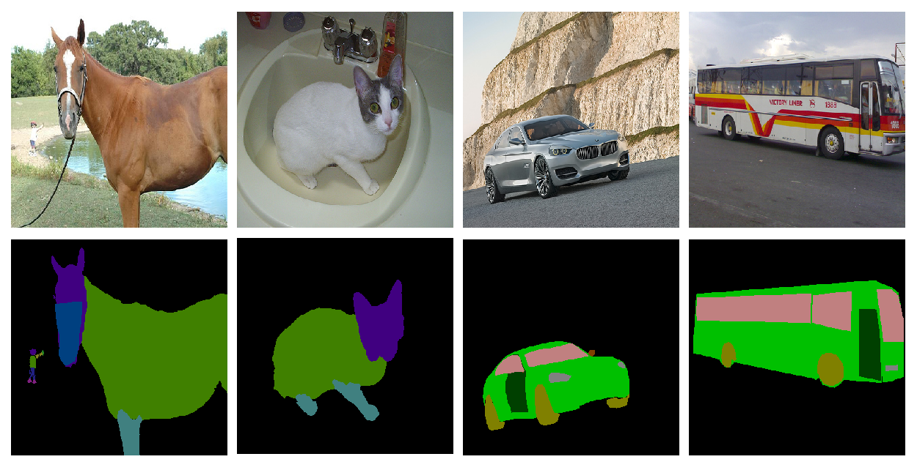

# [NEUCOM 2024] Advancing Zero-Shot Semantic Segmentation through Attribute Correlations
[Runtong Zhang]<sup>1</sup>, [Fanman Meng]<sup>1</sup>, [Shuai Chen]<sup>1</sup>, [Qingbo Wu]<sup>1</sup>, [Linfeng Xu]<sup>1</sup>, [Hongliang Li]<sup>1</sup> <br />
<sup>1</sup> University of Electronic Science and Techonology of China

## Abstract
We advance the zero-shot semantic segmentation through attribute correlations. Specifically, we propose a hierarchical semantic segmentation framework incorporating an attribute prompt tuning method. Correspondingly, we construct a Visual Hierarchical Semantic Classes (VHSC) benchmark, meticulously annotating shared-attributes at the pixel level to conduct the experiments. Extensive experiments on the VHSC benchmark showcase the superior performance of our method compared to existing zero-shot semantic segmentation methods, achieving mIoU of 73.0\% and FBIoU of 87.5\%. <br />


## Requirements

* Python == 3.7.16
* Pytorch == 1.10.1
* Cuda == 11.3
* Torchvision == 0.11.2
* GPU == NVIDIA Titan XP


## Dataset
Visual Hierarchical Semantic Classes (VHSC) benchmark.

Link: (Coming soon)

## Training
```
python train.py configs/vhsc/vpt_seg_attr20_bg_AttrPrompt_vit-b_512x512.py
```
## Evaluation
```
python test.py configs/vhsc/vpt_seg_attr20_bg_AttrPrompt_vit-b_512x512.py checkpoints/AttrPrompt20k.pth
```

## Acknowledgement
Our implementation is mainly based on following repositories. Thanks for their authors.
* [CLIP](https://github.com/openai/CLIP)
* [ZegCLIP](https://github.com/ZiqinZhou66/ZegCLIP)
* [Visual Prompt Tuning](https://github.com/KMnP/vpt)

